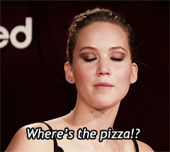

# Pizza

	

Where is the best pizza in the world? 

This is a community project that couldn't be born out of a single person and 
thus collects the contributions of many collaborators. Originally it was at <a 
href="https://github.com/stevekinney/pizza" alt="original 
project">stevekinney/pizza</a>, to which go my thanks for the idea and first 
realization.

It goes without saying that many cities and countries are missing and we need 
your contributions to signal the best pizzerias in them. Only true pizza 
though, no deep-dishes or focaccias. Pull requests are more than welcome, vital 
even.

To actually know how to contribute, check the [Contribute file](CONTRIBUTING)

* [Pizzeria Bianco](http://www.pizzeriabianco.com) - 623 E. Adams Street, **Phoenix**, Arizona, USA
* [The Cheese Board Collective](http://cheeseboardcollective.com) - 1504 Shattuck Avenue, **Berkeley**, California, USA
* [Emilia's](http://emiliaspizzeria.com) - 2995 Shattuck Avenue, **Berkeley**, California, USA
* [Celestino's](http://www.celestinosnypizza.com) - 101 Salem Street, **Chicago**, Illinois, USA
* [Pizzeria Mozza](http://www.pizzeriamozza.com) - 641 North Highland Avenue, **Los Angeles**, California, USA
* [Nicks](http://oaklandstylepizza.com) - 6211 Shattuck Avenue, **Oakland**, California, USA
* [Terun](http://terunpizza.com) - 448 S. California Avenue, **Palo Alto**, California, USA
* [Pizza Port Ocean Beach](http://www.pizzaport.com) - 1956 Bacon Street, **San Diego**, California, USA
* [Sicilian Thing Pizza](http://www.sicilianthingpizza.com) - 4046 30th Street, **San Diego**, California, USA
* [Tony's Pizza Napoletana](http://tonyspizzanapoletana.com) - 1570 Stockton Street, **San Francisco**, California, USA
* [Una Pizza Napoletana](http://www.unapizza.com) - 210 11th Street, **San Francisco**, California, USA
* [Milo & Olive](http://www.miloandolive.com) - 2723 Wilshire Boulevard, **Santa Monica**, California, USA
* [Pizzeria Locale](http://localeboulder.com) - 1730 Pearl Street, **Boulder**, Colorado, USA
* [Lucky Pie Pizza & Taphouse](http://www.lukypiepizza.com/lodo) - 1610 16th Street, **Denver**, Colorado, USA
* [Grimaldi's Pizzeria](http://www.grimaldispizzeria.com) - 500 16th Street, **Denver**, Colorado, USA
* [Cart Driver](http://cart-driver.com) - 2500 Larimer Street, **Denver**, Colorado, USA
* [Da Legna](http://dalegna.com) - 858 State Street, **New Haven**, Connecticut, USA
* [Modern Apizza](http://www.modernapizza.com) - 874 State Street, **New Haven**, Connecticut, USA
* [Sally's Apizza](http://www.sallysapizza.com) - 237 Wooster Street, **New Haven**, Connecticut, USA
* [2 Amys](http://2amyspizza.com) - 3715 Macomb Street NW, **Washington**, DC, USA
* [Pete's New Haven Pizza](http://petesapizza.com) - 1400 Irving Street NW #103, **Washington**, DC, USA
* [Leonardo's By The Slice](http://www.leonardosgainesville.com) - 1245 W University Avenue, **Gainesville**, Florida, USA
* [Satchel's](http://www.satchelspizza.com) - 1800 NE 23rd Avenue, **Gainesville**, Florida, USA
* [Lazy Moon](http://www.lazymoonpizza.com) - 11551 University Boulevard, **Orlando**, Florida, USA
* [Ammazza](http://ammazza.com) - 591 Edgewood Avenue, **Atlanta**, Georgia, USA
* [Antico Pizza Napoletana](http://littleitalia.com) - 1093 Hemphill Avenue, **Atlanta**, Georgia, USA
* [Coalfire](http://coalfirechicago.com) - 1321 West Grand Avenue, **Chicago**, Illinois, USA
* [Spacca Napoli](http://www.spaccanapolipizzeria.com) - 1769 West Sunnyside Avenue, **Chicago**, Illinois, USA
* [Pizza X](http://www.pizzaxbloomington.com) - 1791 East 10th Street, **Bloomington**, Indiana, USA
* [Napolese](http://napolesepizzeria.com) - 30 S Meridian Street, **Indianapolis**, Indiana, USA
* [Santarpio's Pizza](http://www.santarpiospizza.com) - 111 Chelsea Street, **Boston**, Massachusetts, USA
* [Pizza Luce](https://pizzaluce.com) - 119 N 4th Street, **Minneapolis**, Minnesota, USA
* [Pizzeria Lola](http://www.pizzerialola.com) - 5557 South Xerxes Avenue, **Minneapolis**, Minnesota, USA
* [Punch Neapolitan Pizza](http://www.punchpizza.com) - 210 E Hennepin Avenue, **Minneapolis**, Minnesota, USA
* [Settebello](http://settebello.net) - 140 S Green Valley Parkway, **Henderson**, Nevada, USA
* [Porta](http://pizzaporta.com) - 911 Kingsley Street, **Asbury Park**, New Jersey, USA
* [DeLorenzo's Pizza](https://www.delorenzospizza.com/) - 147 Sloan Avenue, **Hamilton**, Ohio, USA
* [Porta](http://pizzaporta.com) - 135 Newark Avenue, **Jersey City**, New Jersey, USA
* [Razza](http://www.razzanj.com) - 275 Grove Street, **Jersey City**, New Jersey, USA
* [Farina](http://www.farinapizzeria.com) - 510 Central Avenue SE, **Albuquerque**, New Mexico, USA
* [Slice Parlor](http://www.sliceparlor.com) - 3410 Central Avenue SE, **Albuquerque**, New Mexico, USA
* [Forcella](https://www.forcellaeatery.com/) - 485 Lorimer Street, **New York**, New York, USA
* [Lucali](http://www.lucali.com) - 575 Henry Street, **New York**, New York, USA
* [Paulie Gee's](http://pauliegee.com) - 60 Greenpoint Avenue, **New York**, New York, USA
* [Roberta's](http://www.robertaspizza.com) - 261 Moore Street, **New York**, New York, USA
* [Saraghina](http://www.saraghinabrooklyn.com) - 435 Halsey Street, **New York**, New York, USA
* [John's of Bleeker St](http://www.johnsbrickovenpizza.com) - 278 Bleecker Street, **New York**, New York, USA
* [Lombardi's](http://www.firstpizza.com) - 32 Spring Street, **New York**, New York, USA
* [Motorino](http://www.motorinopizza.com) - 349 East 12th Street, **New York**, New York, USA
* [Prince Street Pizza](http://www.princestreetpizzanyc.com) - 27 Prince Street, **New York**, New York, USA
* [Standard Pizza Co.](http://www.standardpizzacoasheville.com) - 631 Haywood Road, **Asheville**, North Carolina, USA
* [Pizzeria Toro](http://www.pizzeriatoro.com) - 105 East Chapel Hill Street, **Durham**, North Carolina, USA
* [Capital Creations Gourmet Pizza](http://capitalcreations.com) - 1842 Wake Forest Road, **Raleigh**, North Carolina, USA
* [Brooklyn Pizza](http://www.brooklynpizzapowell.com) - 240 North Liberty Street, **Powell**, Ohio, USA
* [Apizza Scholls](http://apizzascholls.com) - 4741 SE Hawthorne Boulevard, **Portland**, Oregon, USA
* [Ken's Artisan](http://kensartisan.com) - 338 NW 21st Avenue, **Portland**, Oregon, USA
* [Dock Street Brewing Co.](http://www.dockstreetbeer.com) - 701 South 50th Street, **Philadelphia**, Pennsylvania, USA
* [In Riva](http://www.in-riva.com) - 4116 Ridge Avenue, **Philadelphia**, Pennsylvania, USA
* [Nomad Pizza](http://www.nomadpizzaco.com) - 611 South 7th Street, **Philadelphia**, Pennsylvania, USA
* [Aiello's Pizza](http://aiellospizza.com) -  2112 Murray Avenue, **Pittsburgh**, Pennsylvania, USA
* [Roma Pizza](http://www.romapizzapottsville.com) - 116 West Market Street, **Pottsville**, Pennsylvania, USA
* [Hard Knox Pizzeria Bearden](https://hardknoxpizza.com) - 4437 Kingston Pike, **Knoxville**, Tennessee, USA
* [Desano Pizza Bakery](http://desanopizza.com) - 115 16th Avenue South, **Nashville**, Tennessee, USA
* [40 North](http://www.40northpizza.com) - 1502 South 1st Street, **Austin**, Texas, USA
* [The Austin Beer Garden Brewing Company](http://theabgb.com) - 1305 West Oltorf, **Austin**, Texas, USA
* [The Backspace](http://thebackspace-austin.com) - 507 San Jacinto Street, **Austin**, Texas, USA
* [Bufalina](http://www.bufalinapizza.com) - 1519 East Cesar Chavez Street, **Austin**, Texas, USA
* [Frank's Pizza](http://frankspizza.com) - 417 Travis Street, **Houston**, Texas, USA
* [Flying Squirrel](http://www.flyingsquirrelpizza.com) - 4920 S. Genesee Street, **Seattle**, Washington, USA
* [Flying Squirrel](http://www.flyingsquirrelpizza.com) - 8310 5th Avenue NE, **Seattle**, Washington, USA
* [Flying Squirrel](http://www.flyingsquirrelpizza.com) - 5701 Airport Way South, **Seattle**, Washington, USA
* [Humble Pie](http://humblepieseattle.com) - 525 Rainier Avenue South, **Seattle**, Washington, USA
* [Serious Pie](http://seriouspieseattle.com) - 316 Virginia Street, **Seattle**, Washington, USA
* [Via Tribunali](http://viatribunali.com) - 913 East Pike Street, **Seattle**, Washington, USA
* [Salvatore's Tomato Pies](http://salvatorestomatopies.com) - 912 East Johnson Street, **Madison**, Wisconsin, USA
* [La Stella del Sud](https://www.instagram.com/la.stella.del.sud.lambach/) - Marktplatz 2, **Lambach**, Austria
* [Pepper](http://pepper-tirana.com) - Rruga  Brigada e VIII, **Tirana**, Albania
* [La Piola Pizza](http://www.lapiolapizza.com) - Place Saint-Josse 8, **Bruxelles**, Belgium
* [La Pizza è Bella](https://lapizzaebella.be/en) - Rue Lebeau 75, **Bruxelles**, Belgium
* [La Piola Pizza](http://www.lapiolapizza.com) - Place Saint-Josse 8, **Bruxelles**, Belgium
* [La Pizza è Bella](https://lapizzaebella.be/en) - Rue Lebeau 75, **Bruxelles**, Belgium
* [La Vecchia Napoli](http://www.lavecchianapoli.be) - Pensstraat 6, **Leuven**, Belgium
* [Bitondo Pizzeria]() - 11 Clinton Street, **Toronto**, Ontario, Canada
* [Pizzeria Libretto](http://pizzerialibretto.com) - 155 University Avenue, **Toronto**, Ontario, Canada
* [FBI Pizza](http://www.fbipizza.com) - 2336 Lake Shore Boulevard West, **Toronto**, Ontario, Canada
* [Zio's](https://m.facebook.com/pages/Zios-Pizza/444640382240517) - 214 Church Street, **Moncton**, New Brunswick, Canada
* [Pizza Nuova](http://www.pizzanuova.cz) - Revoluční 655/1, **Prague**, Czechia
* [Bæst](http://baest.dk) - Guldbergsgade 29, **Copenhagen**, Denmark
* [Luca](https://www.iloveluca.dk) - Gammel Strand 42, **Copenhagen**, Denmark
* [Mother](https://mother.dk) - Høkerboderne 9-15, **Copenhagen**, Denmark
* [Kaja Pizza Köök](http://kajapizza.ee) - Õle 33, **Tallin**, Estonia
* [Putte's](http://puttes.fi) - Kalevankatu 6, **Helsinki**, Finland
* [La Pizza Cresci](http://maison-cresci.fr/en) - 3 Quai Saint-Pierre, **Cannes**, France
* [Bijou](https://bijou-paris.fr) - 10 Rue Dancourt, **Paris**, France
* [Guillame Grasso](https://www.guillaume-grasso.com) - 45 Rue Brancion, **Paris**, France
* [Louie Louie](https://www.louielouie.paris) - 78 Rue de Charonne, **Paris**, France
* [Manhattan Terrazza](https://www.manhattanterrazza.fr) - 108 Avenue de Villiers, **Paris**, France
* [Ober Mamma](https://www.bigmammagroup.com/en/accueil) - 107 Boulevard Richard Lenoir, **Paris**, France
* [Pizzeria Popolare](https://www.bigmammagroup.com) - 111 Rue Réaumur, **Paris**, France
* [Rossini](http://www.yelp.com/biz/rossini-paris-3) - 8 Rue Rossini, **Paris**, France
* [Tripletta](https://triplettabelleville.fr) - 88 Boulevard de Belleville, **Paris**, France
* [PizzaNostra](https://www.pizzanostra.de) - Lychener Straße 2, **Berlin**, Germany
* [Gazzo](https://www.gazzopizza.com) - Hobrechtstraße 57, **Berlin**, Germany
* [Malafemmena](http://malafemmena.restaurant) - Hauptstraße 85, **Berlin**, Germany
* [Pomodorino](https://www.pomodorino.de/pomodorino) - Straßmannstraße 21, **Berlin**, Germany
* [Standard Serious Pizza](http://www.standard-berlin.de) - Templiner Straße 7, **Berlin**, Germany
* [Trattoria Toscana](http://www.toscana-tempelhof.de) - Sredzkistraße 49, **Berlin**, Germany
* [Montana](http://www.montana-pizzeria.de) - Weserstraße 14, **Franfkurt am Main**, Germany
* [Jill](https://pizzeria-jill-hamburg.cook-maestro.com/de/) - Bartelsstraße 12, **Hamburg**, Germany
* [60 Secondi](https://www.60-seconds.de) - Occamstraße 11, **Munchen**, Germany
* [Manifesto](https://www.manifestorestaurant.ie) - 208 Rathmines Road Lower, **Dublin**, Ireland
* [Pepe In Grani](http://www.pepeingrani.it) - Vicolo San Giovanni Battista 3, **Caiazzo**, Italy
* [I Masanielli](https://www.facebook.com/masaniellisasamartucci) - Via Antonio Vivaldi 23, **Caserta**, Italy
* [La Loggetta](https://www.facebook.com/PIZZERIALALOGGETTALAB) - Piazza Matteotti 40, **Caserta**, Italy
* [Tre Farine](http://www.trefarine.it) - Via Cesare Battisti 46, **Caserta**, Italy
* [Olio a Crudo](https://www.sorbillo.it/pizzeria-olio-a-crudo) - Via Montevideo 4, **Milan**, Italy
* [50 Kalò](http://www.50kalo.it) - Piazza Sannazaro 201/c, **Naples**, Italy
* [Di Matteo](http://www.pizzeriadimatteo.com) - Via dei Tribunali 94, **Naples**, Italy
* [Gino e Toto Sorbillo](http://www.sorbillo.it) - Via dei Tribunali 32, **Naples**, Italy
* [L'Antica Pizzeria da Michele](http://www.damichele.net) - Via Cesare Sersale 1-3, **Naples**, Italy
* [La Notizia](http://www.pizzarialanotizia.com) - Via Michelangelo da Caravaggio 53, **Naples**, Italy
* [Starita](https://www.pizzeriastarita.it) - Via Materdei 27/28, **Naples**, Italy
* [10 Diego Vitagliano](http://www.10pizzeria.it) - Via Nuova Agnano 1, **Pozzuoli**, Italy
* [Biga280](http://www.biga280.it) - Via Campi Flegrei 13, **Pozzuoli**, Italy
* [Angelo Pezzella](http://www.angelopezzella.it) - Via Appia Nuova 1095, **Rome**, Italy
* [Berberè](https://www.berperepizza.it/en) - Via Mantova 5, **Rome**, Italy
* [I Quintili](https://www.facebook.com/Iquintili1) - Via San Biagio Platani 320, **Rome**, Italy
* [La Gatta Mangiona](http://www.lagattamangiona.com) - Via Federico Ozanam 30-32, **Rome**, Italy
* [Piccolo Buco](https://www.pizzeriapiccolobuco.it) - Via del Lavatore 91, **Rome**, Italy
* [Pizzarium](http://www.bonci.it) - Via della  Meloria 43, **Rome**, Italy
* [Capri](http://www.capripizzeriasalerno.it) - Via Torrione 36, **Salerno**, Italy
* [Resilienza](https://www.facebook.com/PizzeriaResilienza) - Via Andrea Sabatini 4, **Salerno**, Italy
* [I Tigli](http://www.pizzeriaitigli.it) - Via Camporosolo 11, **San Bonifacio**, Italy
* [Pizzeria Fratelli Salvo](http://www.salvopizzaioli.it) - Largo Arso 10-16, **San Giorgio a Cremano**, Italy
* [Saporè](http://www.saporeverona.it) - Via Ponte 55A, **San Martino Buon Albergo**, Italy
* [Pizza Strada](http://www.pizzastrada.jp) - NS Azabu Juban  Bldg. 1F, 3-6-2, **Tokyo**, Japan
* [La Vecchia Taranto]() - 279 Saint Paul Street, **Valletta**, Malta
* [Vinoteket](http://vinoteket.no) - Henrik Ibsens Gate 60a, **Oslo**, Norway
* [Fiorentina](https://fiorentina.com.pl) - Grodzka 63, **Kraków**, Malopolska, Poland
* [Nolio](https://nolio.pl) - Krakowska 27, **Kraków**, Malopolska, Poland
* [Pizzeria 00](http://pizzeria00.pl) - Kalwaryjska 32, **Kraków**, Malopolska, Poland
* [Primo Italian](http://www.primoitalian.pl) - Kazimierza Brodzińskiego 4, **Kraków**, Malopolska, Poland
* [Ave Pizza](https://www.avepizza.pl) - Topiel 12, **Warsaw**, Masovia, Poland
* [Ciao a Tutti Due](https://www.facebook.com/ciaotuttipizza/) - Jarosława Dąbrowskiego 27, **Warsaw**, Masovia, Poland
* [Mąka i Woda](https://www.facebook.com/MakaiWoda) - Chmielna 13a, **Warsaw**, Poland, Masovia
* [Forno d'Oro](http://www.fornodoro.pt) - Rua da Artilharia 1 16b, **Lisbon**, Portugal
* [Animaletto](http://www.animaletto.ro) - Strada Visarion 10, **Bucharest**, Romania
* [Eataly Moscow](https://www.eataly.ru) - Ulitsa Kiyevskaya 2, **Moscow**, Russia
* [Luciano](http://www.lucianomoscow.ru) - Smolenskaya Square 3, **Moscow**, Russia
* [Basilicò](https://basilico-italian-restaurant.business.site) - Dunajská 25, **Bratislava**, Slovakia
* [Pinsa Rustika](https://www.rustika.si/) - Trubarjeva Cesta 44, **Ljubljana**, Slovenia
* [Pop's Pizza & Sport]() - Breg 2, **Ljubljana**, Slovenia
* [Trappa](https://www.trappa.si/) - Ulica Koprska 94, **Ljubljana**, Slovenia
* [Trappica](https://www.trappa.si/) - Rimska Cesta 6, **Ljubljana**, Slovenia
* [La Balmesina](http://www.labalmesina.com) - Carrer de Balmes 193, **Barcelona**, Spain
* [Grosso Napoletano](http://www.grossonapoletano.com) - Calle de Sta Engracia 48, **Madrid**, Spain
* [Oven](http://www.oven.es) - Calle Gran Via 6, **Madrid**, Spain
* [Lilla Napoli](http://www.lillanapoli.se) - Halmstadvägen 1, **Falkenberg**, Sweden
* [Bov](http://www.bovgbg.com) - Gibraltargatan 20, **Goteborg**, Sweden
* [Onsala Pizzeria](http://www.onsalapizzeria.se) - Kopparvägen 30, **Onsala**, Sweden
* [Kytaly](https://kytaly.ch) - Boulevard Georges-Favon 12, **Geneva**, Switzerland
* [Luigia](http://www.luigia.ch) - Chemin de la Tourelle 2, **Geneva**, Switzerland
* [Positano](https://positano.kiev.ua) - Pavla Tychyny Avenue 1в, **Kyiv**, Ukraine
* [La Favorita](http://lafav.co.uk/glasgow) - 23-25 Gibson Street, **Glasgow**, UK
* [Paesano](https://paesanopizza.co.uk) - 94 Miller Street, **Glasgow**, UK
* [50 Kalò di Ciro Salvo](https://www.50kalo.it/ciro__salvo.php) - 7 Northumberland Avenue, **London**, UK
* [Addomé](http://www.addomme.co.uk) - 17-21 Sternhold Avenue, **London**, UK
* [Hai Cenato](http://www.haicenato.co.uk) - 2 Sir Simon Milton Square, **London**, UK
* [L'Antica Pizzeria](http://www.anticapizzeria.co.uk) - 66 Heath Street, **London**, UK
* [L'Antica Pizzeria da Michele](https://www.anticapizzeriadamichele.co.uk) - 199 Baker Street, **London**, UK
* [Made of Dough](http://www.madeofdough.co.uk) - 182 Bellenden Road, **London**, UK
* [Pizza Pilgrims](http://pizzapilgrims.co.uk) - 11 Dean Street, **London**, UK
* [Princi](http://www.princi.com) - 135 Wardour Street, **London**, UK
* [Santoré](http://www.santorerestaurant.london) - 59-61 Exmouth Market, **London**, UK
* [Sodo Pizza Hoxton](https://www.sodopizza.co.uk) - 63 Pitfield Street, **London**, UK
* [Double Zero](https://www.pizzeriadoublezero.com) - 368 Barlow Moor Road, **Manchester**, UK
* [Rudy's Neapolitan Pizza](https://www.rudyspizza.co.uk) - 9 Cotton Street, **Manchester**, UK
* [It's a Pizza Thing](https://www.facebook.com/apizzathing) - 38-40 Adelaide Road, **Southampton**, UK
* [Braz](http://www.brazpizzaria.com.br) - Rua Graúna 125, **São Paulo**, Brazil
